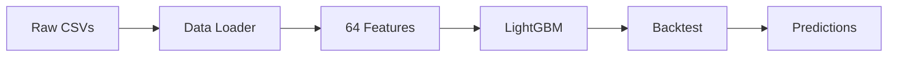
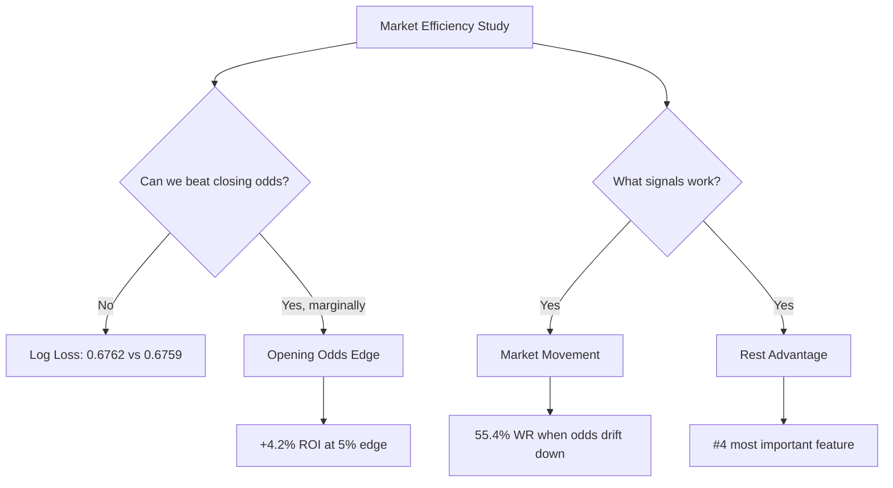
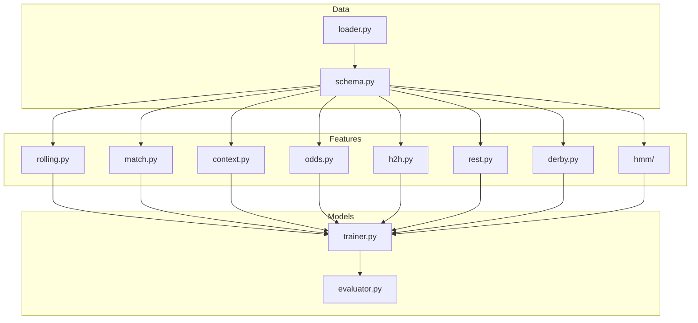
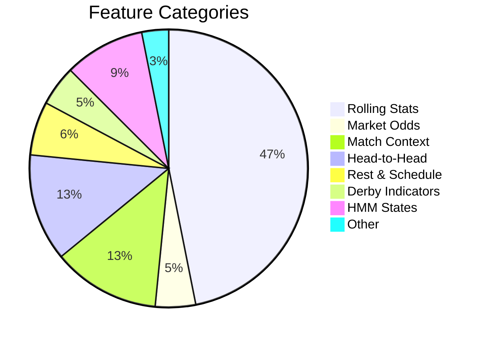

<p align="center">
  <h1 align="center">⚽ Fussball</h1>
  <p align="center"><em>Football over/under goals prediction with 64 features across 10 European leagues</em></p>
</p>

<p align="center">
  
  
  
  
  
</p>
---

## What is this?

Fussball is a complete ML pipeline for predicting football match outcomes — specifically over/under goal lines. It fetches historical data from [Football-Data.co.uk](https://www.football-data.co.uk/), engineers 64 features (rolling stats, head-to-head history, rest days, derby indicators, HMM states), and trains LightGBM models to find edges against bookmaker odds.

**The honest truth:** Closing market odds are brutally efficient. This project doesn't claim to beat them — it measures *how efficiently* they're priced and identifies the narrow windows where edges exist.

## Pipeline



## Key Findings



## Results

### Opening vs Closing Odds

| Strategy | Edge | ROI | Bets | Win Rate |
|---|---|---|---|---|
| A: Opening + Model | ≥0.05 | **+4.2%** | 226 | 59.3% |
| B: Closing + Model | ≥0.05 | **+8.4%** | 73 | 64.4% |
| C: Market Movement | ≥0.05 | -10.3% | 224 | — |

### Asian Handicap

| Metric | Model | Market |
|---|---|---|
| Sign Accuracy | **66.5%** | 50.2% |
| Brier Score | 0.2222 | 0.2508 |
| Brier Advantage | **+0.0286** | — |

### Feature Importance (Top 5)

```
 1. market_implied_prob: 1313
 2. market_overround:    456
 3. market_log_odds:     340
 4. rest_advantage:      147  ← NEW
 5. away_ppg_avg_5:      144
```
## Architecture



## Setup

```bash
# Clone
git clone https://github.com/akorite/fussball.git
cd fussball

# Install (uses uv for fast installs)
pip install -e ".[dev]"

# Or with uv
uv sync --group dev

# Verify
python -c "import fussball; print(fussball.__version__)"
```

## Quick Start

```bash
# 1. Download historical data (10 leagues, 2016-2025)
python -m fussball.cli download-data

# 2. Run backtest
python -m fussball.cli backtest

# 3. Predict upcoming matches
python -m fussball.cli predict
```

## Evaluation Scripts

```bash
# Opening vs closing odds comparison
python scripts/opening_strategy.py

# Asian handicap market analysis
python scripts/ah_eval.py

# Multi-goal-line evaluation (1.5, 2.5, 3.5)
python scripts/multiline_eval.py

# League-specific models
python scripts/league_eval.py
python scripts/league_eval.py
```

## Features (64 total)

| Category | Count | Examples |
|---|---|---|
| **Rolling stats** | 30 | Goals scored/conceded, shots, PPG (5/10/20 windows) |
| **Market odds** | 3 | Implied probability, log odds, overround |
| **Match context** | 8 | League position, matchweek, home/away form |
| **Head-to-head** | 8 | H2H goal avg, over/under rate, win rate |
| **Rest & schedule** | 4 | Days since last match, games in 30 days |
| **Derby indicators** | 3 | Same city, same region, rivalry intensity |
| **HMM states** | 6 | Expected goals, variance, entropy from Hidden Markov Model |
| **Other** | 2 | Home advantage, goal difference trends |

## Feature Breakdown



## Data

Free historical CSVs from [Football-Data.co.uk](https://www.football-data.co.uk/):

- **Leagues:** E0 (Premier League), SP1 (La Liga), D1 (Bundesliga), I1 (Serie A), F1 (Ligue 1), E1 (Championship), D2 (2. Bundesliga), SP2 (La Liga 2), I2 (Serie B), N1 (Eredivisie)
- **Seasons:** 2016-2025 (10 seasons)
- **Matches:** ~38,000 total

The `DataSource` protocol abstracts the data source — swap in a paid API (Odds API, Sportmonks) without touching downstream code.

## Testing

```bash
# Full suite
pytest

# With coverage
pytest --cov=src/fussball

# Skip slow tests
pytest -m "not slow"
```

## How it works

1. **Data loading** — CSVs are parsed into typed `MatchRecord` objects with validation
2. **Feature engineering** — 64 features computed via rolling windows, groupby transforms, and lookup tables
3. **Model training** — LightGBM with tuned hyperparameters (Optuna-optimized)
4. **Evaluation** — Global split (train pre-2025, test 2025-2026) with calibration and blending
5. **Edge detection** — Model probabilities compared to market implied probabilities

## Contributing

Contributions welcome! This project is honest about its findings — closing odds are brutally efficient. But there are narrow edges to be found:

- **Better data sources** — xG, possession, lineup data for older seasons
- **In-play features** — live match statistics
- **Alternative markets** — correct score, half-time/full-time
- **Ensemble methods** — combining multiple model architectures

Open an issue or submit a PR.

## License

MIT
